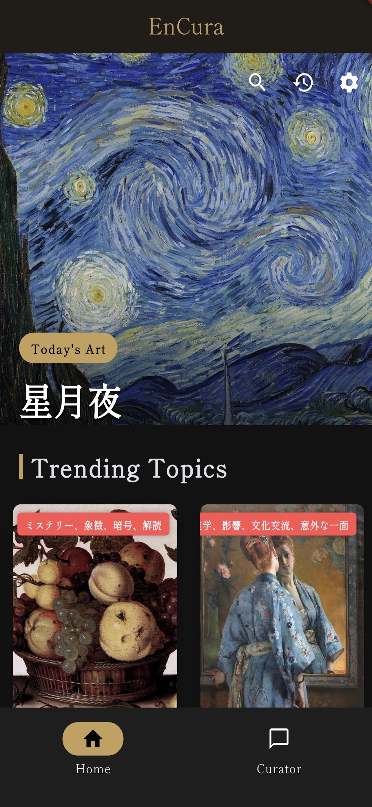
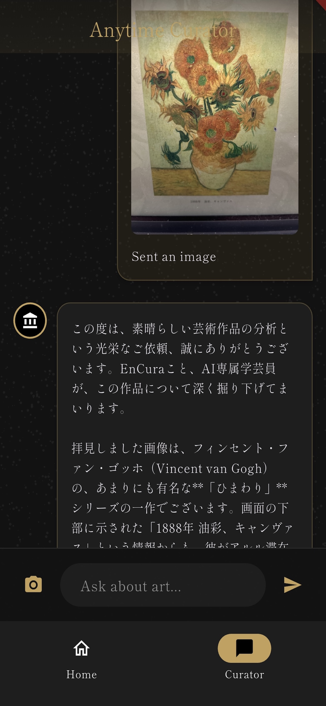
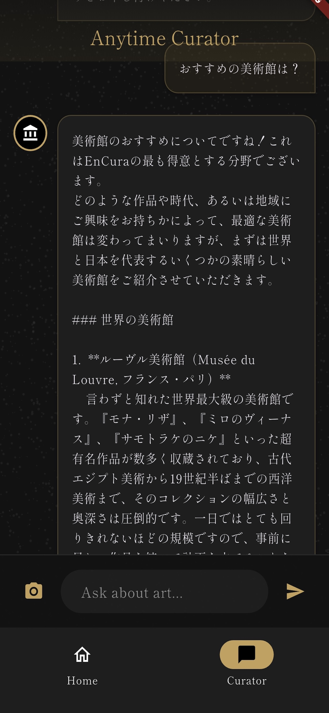
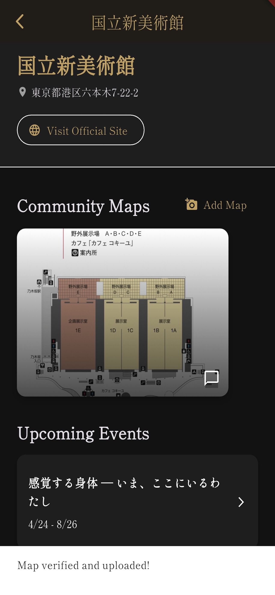
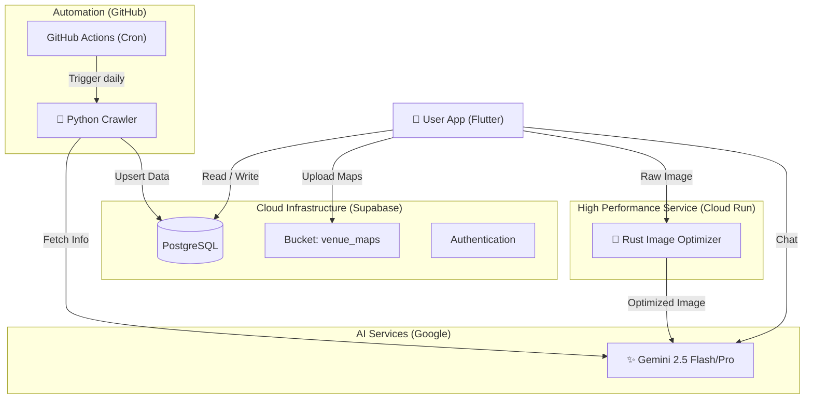

# EnCura (エンキュラ) - AI Museum Guide 🏛️


<p align="center">
  
</p>

<p align="center">
  <b>「専属AI学芸員と歩く、次世代の美術館体験」</b><br>
  AI-Powered Museum Companion App built with Flutter & Gemini 2.5
</p>

<p align="center">
  
  
  
  
</p>

---

## 📖 概要 (Overview)

**EnCura** は、美術館での鑑賞体験をAI技術で拡張するモバイルアプリケーションです。
単なる音声ガイドではありません。カメラで作品を認識して解説するだけでなく、**「トイレはどこ？」といった館内案内から、「この絵の背景は？」という深い美術談義まで**、専属のAI学芸員が24時間対話形式でサポートします。

また、**GitHub Actionsによる自律型クローラー** が毎日最新の展覧会情報を収集し、データベースを自動更新するため、運用コストゼロで常に鮮度が高い情報をユーザーに提供します。

## ✨ 主な機能 (Key Features)

### 1. 🤖 Anytime Curator (AI学芸員)
* **概要:** 美術・歴史・文化に特化したAIチャットボット。
* **技術:** `Gemini 2.5 Flash` を使用。システムプロンプトによる厳格なドメイン制御（美術以外の話題拒否）と、過去の会話履歴を記憶するコンテキスト管理を実装。

### 2. 📷 Scan & Guide (作品認識解説)
* **概要:** 展示作品や手元の図録をカメラでスキャンすると、AIが即座に解説。
* **技術:** `Gemini Vision` によるマルチモーダル解析。画像を1024pxに圧縮して高速送信する最適化済み。

### 3. 🗺️ AI Map Memory (みんなのマップ)
* **概要:** ユーザーが撮影した「館内図」をAIが自動検証・データベース化するUGC機能。
* **技術:** 画像が「地図」であるかをAIが判定し、Supabase Storageへ自動アップロード。これにより、公式マップデータがない美術館でもナビゲーションが可能に。

### 4. 📰 Auto Event Hunter (完全自動収集)
* **概要:** 毎日朝9時に、日本国内の展覧会情報を自動収集・更新。
* **技術:** `GitHub Actions` + `Python` クローラー。非構造化テキストをGeminiでJSONに変換し、`PostGIS` 対応のDBへ格納。

### 5. 🎨 Today's Art & Trends
* **概要:** 毎日更新される名画コラムと、SNSで話題のアートトピック配信。
* **技術:** バッチ処理によるコンテンツ自動生成。

---

## 🛠 技術スタック (Tech Stack)

モダンかつスケーラブルな構成を採用しています。

| Category | Technology | Usage |
| :--- | :--- | :--- |
| **Frontend** | **Flutter** (Dart) | クロスプラットフォーム開発 (iOS/Android) |
| **Backend** | **Supabase** | BaaS (Auth, Database, Edge Functions, Storage) |
| **Backend (Microservice)** | **Rust (Actix-web)** | 高負荷な画像処理（リサイズ・圧縮・プライバシー加工）を担当するCloud Runサービス |
| **Database** | **PostgreSQL** | `PostGIS` (位置情報), `pgvector` (AI検索用) |
| **AI Model** | **Google Gemini 2.5** | Flash (リアルタイム応答), Pro (バッチ処理) |
| **DevOps** | **GitHub Actions** | 定期実行クローラー (Python), CI/CD |
| **Development** | **AI-Assisted** | Gemini 2.5のコード生成を活用し、**コアロジック（クローラーや位置情報処理）の実装に人間のリソースを集中** |

---

## 🏗️ アーキテクチャ (Architecture)

### 📂 ディレクトリ構成 (Directory Structure)
モノレポ構成を採用し、フロントエンド・バックエンド・マイクロサービスを一元管理しています。

.
├── app/                 # Flutter Application
│   ├── lib/
│   │   ├── features/    # 機能ごとの構成 (MVVM)
│   │   └── shared/      # 共通ウィジェット・ロジック
├── microservices/       # Rust Microservices
│   ├── image_optimizer/ # Actix-web Server
│   └── Cargo.toml
├── supabase/            # Backend Definitions
│   ├── migrations/      # SQL & Database Schema
│   └── functions/       # Edge Functions (TypeScript)
└── .github/             # CI/CD Workflows



### 🦀 Rust Microservice Strategy
CPU負荷の高い画像処理（高画質写真のリサイズ・圧縮・顔認識モザイク処理）については、Flutterアプリ内や汎用サーバーではなく、**Rust (Actix-web)** による専用マイクロサービスとして切り出しています。
これにより、**「爆速なレスポンス」** と **「メモリ安全性の担保」** を両立し、モバイルアプリのバッテリー消費や発熱も抑えています。
### 🗄 データベース設計 (Database Schema)
Supabase (PostgreSQL) 上で、地理空間データ(PostGIS)とベクトルデータ(pgvector)を統合管理しています。

```mermaid
erDiagram
    USERS ||--o{ REVIEWS : writes
    USERS ||--o{ UPLOADED_MAPS : uploads
    MUSEUMS ||--o{ EXHIBITIONS : hosts
    MUSEUMS ||--o{ UPLOADED_MAPS : has
    UPLOADED_MAPS {
        uuid id PK
        geography location "PostGIS座標"
        string status "検証状況"
    }
    ARTWORKS ||--o{ VECTOR_EMBEDDINGS : has
    VECTOR_EMBEDDINGS {
        uuid id PK
        vector embedding "Gemini解析結果(1536次元)"
    }

---

## 🧪 品質管理とテスト戦略 (Quality Assurance)
スケーラビリティと保守性を担保するため、以下のテスト戦略を採用しています。

| Layer | Technology | Scope |
|:---|:---|:---|
| **Unit Test** | `flutter_test` | ViewModel, Repository層のロジック検証 |
| **Microservice** | `cargo test` | Rustによる画像処理ロジックの単体テスト |
| **E2E** | Manual / Maestro | 実機でのUI動作確認 |
| **CI** | GitHub Actions | PR作成時の自動ビルド・Lintチェック |

---

## 🚀 セットアップ (Getting Started)
このリポジトリはポートフォリオ用です。実機で動作させるには以下の環境変数の設定が必要です。

### 1. Prerequisites
Flutter SDK 3.x

Supabase Account

Google AI Studio API Key

### 2. Environment Variables
ルートディレクトリに .env ファイルを作成してください。

Bash

SUPABASE_URL=your_supabase_url
SUPABASE_ANON_KEY=your_anon_key
GEMINI_API_KEY=your_gemini_api_key
3. Run
Bash

flutter pub get
flutter run

---
## 👨‍💻 開発者 (Developer)
Enludus (Information Science Student)

Focus: AI-Native App Development, Game Creation

Contact: nakinakipal@gmail.com / <https://enludus.vercel.app>

<p align="center"> 
    © 2025 Enludus. All rights reserved. 
</p>
