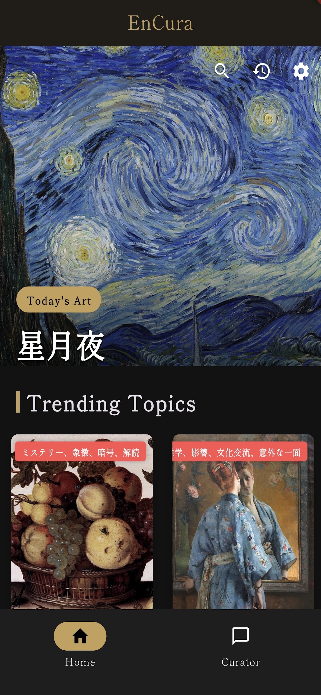
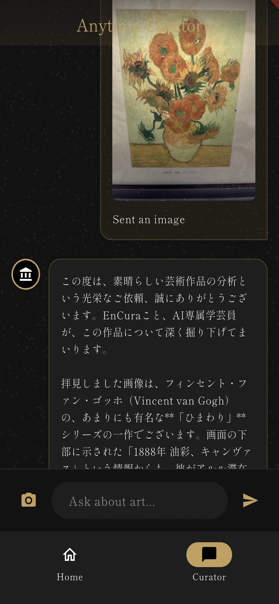
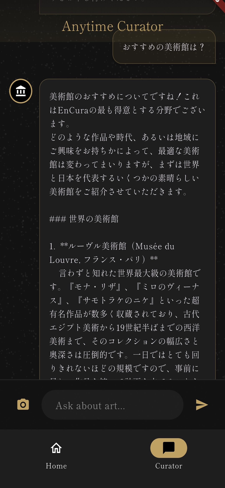
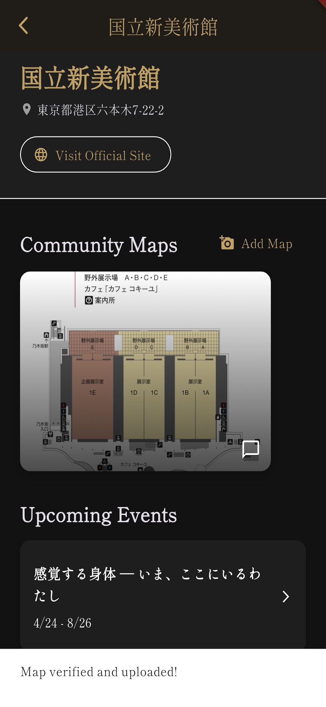
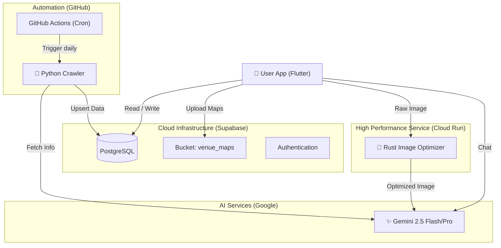

# EnCura - AI Museum Guide 🏛️

<p align="center">
  
</p>

<p align="center">
  <b>"Next-Generation Museum Experience with Your Personal AI Curator"</b><br>
  AI-Powered Museum Companion App built with Flutter & Gemini 2.5
</p>

<p align="center">
  
  
  
  
</p>

---

[🇯🇵 Japanese (日本語)](README.ja.md)

## 📖 Overview

**EnCura** is a mobile application that extends the museum viewing experience with AI technology.
It is not just an audio guide. From simple guidance like "Where is the restroom?" to deep art discussions like "What is the historical background of this painting?", your personal AI curator provides 24/7 conversational support. It recognizes artworks via camera and provides instant explanations.

In addition, an **autonomous crawler using GitHub Actions** automatically collects and updates exhibition information daily, ensuring users always have access to the freshest information with zero operational cost.

## ✨ Key Features

### 1. 🤖 Anytime Curator (AI Curator)
*   **Overview:** AI chatbot specialized in art, history, and culture.
*   **Technology:** Uses `Gemini 2.5 Flash`. Implements strict domain control (rejects non-art topics) via system prompts and context management to remember past conversations.

### 2. 📷 Scan & Guide (Artwork Recognition)
*   **Overview:** Scan artworks or catalog images with your camera, and the AI will provide instant explanations.
*   **Technology:** Multimodal analysis using `Gemini Vision`. Images are optimized (compressed to 1024px) for high-speed transmission.

### 3. 🗺️ AI Map Memory (Crowdsourced Maps)
*   **Overview:** UGC feature where the AI automatically verifies and databases user-captured "floor maps".
*   **Technology:** AI determines if an image is a "map" and automatically uploads it to Supabase Storage. This enables navigation even in museums without official map data.

### 4. 📰 Auto Event Hunter (Fully Automated Collection)
*   **Overview:** Automatically collects and updates exhibition information across Japan every morning at 9:00 AM.
*   **Technology:** `GitHub Actions` + `Python` crawler. Unstructured text is converted to JSON by Gemini and stored in a `PostGIS`-enabled DB.

### 5. 🎨 Today's Art & Trends
*   **Overview:** Daily updates of masterpiece columns and trending art topics from social media.
*   **Technology:** Automated content generation via batch processing.

---

## 🛠 Tech Stack

We adopt a modern and scalable configuration.

| Category | Technology | Usage |
| :--- | :--- | :--- |
| **Frontend** | **Flutter** (Dart) | Cross-platform development (iOS/Android) |
| **Backend** | **Supabase** | BaaS (Auth, Database, Edge Functions, Storage) |
| **Backend (Microservice)** | **Rust (Actix-web)** | Cloud Run service handling high-load image processing (resize/compress/privacy) |
| **Database** | **PostgreSQL** | `PostGIS` (Location), `pgvector` (AI Search) |
| **AI Model** | **Google Gemini 2.5** | Flash (Real-time response), Pro (Batch processing) |
| **DevOps** | **GitHub Actions** | Scheduled crawler (Python), CI/CD |
| **Development** | **AI-Assisted** | Leveraging Gemini 2.5 code generation to **focus human resources on core logic implementation** |

---

## 🏗️ Architecture


```mermaid
graph TD
    User["📱 User App (Flutter)"]
    
    subgraph "Cloud Infrastructure (Supabase)"
        DB[("PostgreSQL")]
        Storage["Bucket: venue_maps"]
        Auth["Authentication"]
    end
    
    subgraph "High Performance Service (Cloud Run)"
        Rust["🦀 Rust Image Optimizer"]
    end
    
    subgraph "AI Services (Google)"
        Gemini["✨ Gemini 2.5 Flash/Pro"]
    end
    
    subgraph "Automation (GitHub)"
        Crawler["🤖 Python Crawler"]
        Actions["GitHub Actions (Cron)"]
    end

    %% Flows
    User -->|Chat| Gemini
    User -->|Raw Image| Rust
    Rust -->|Optimized Image| Gemini
    User -->|Read / Write| DB
    User -->|Upload Maps| Storage
    
    Actions -->|Trigger daily| Crawler
    Crawler -->|Fetch Info| Gemini
    Crawler -->|Upsert Data| DB
```

### 🦀 Rust Microservice Strategy
High-CPU tasks like image processing (resizing high-quality photos, compression, face mosaic processing) are offloaded to a dedicated microservice built with **Rust (Actix-web)**, rather than handling them within the Flutter app or a general-purpose server.
This achieves both **"blazing fast response times"** and **"memory safety"**, while minimizing battery consumption and heat generation on the mobile device.

---

## 🚀 Getting Started

This repository is for portfolio purposes. To run it on a real device, the following environment variables are required.

### 1. Prerequisites
*   Flutter SDK 3.x
*   Supabase Account
*   Google AI Studio API Key

### 2. Environment Variables
Create a `.env` file in the root directory.

```bash
SUPABASE_URL=your_supabase_url
SUPABASE_ANON_KEY=your_anon_key
GEMINI_API_KEY=your_gemini_api_key
```

### 3. Run
```bash
flutter pub get
flutter run
```

---

## 👨‍💻 Developer
Enludus (Information Science Student)

Focus: AI-Native App Development, Game Creation

Contact: nakinakipal@gmail.com / https://enludus.vercel.app

<p align="center"> 
    © 2025 Enludus. All rights reserved. 
</p>
